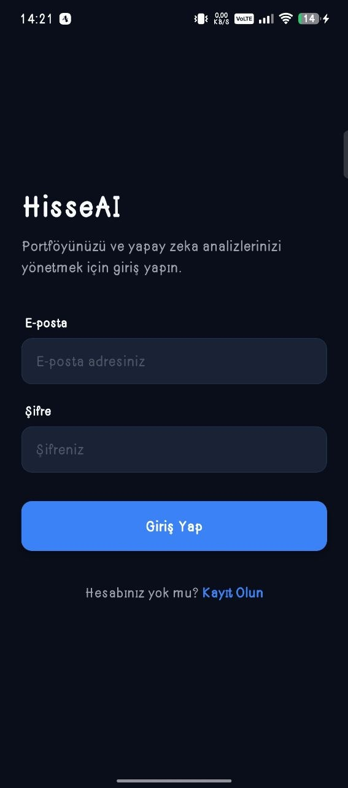
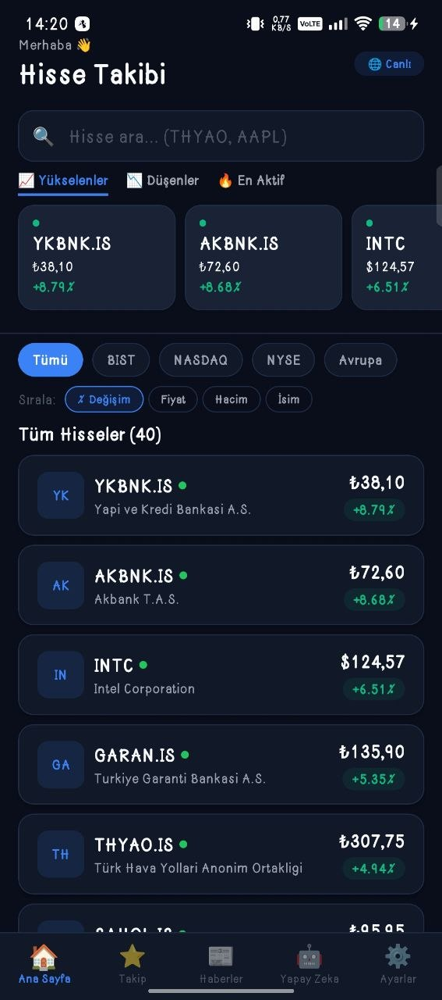
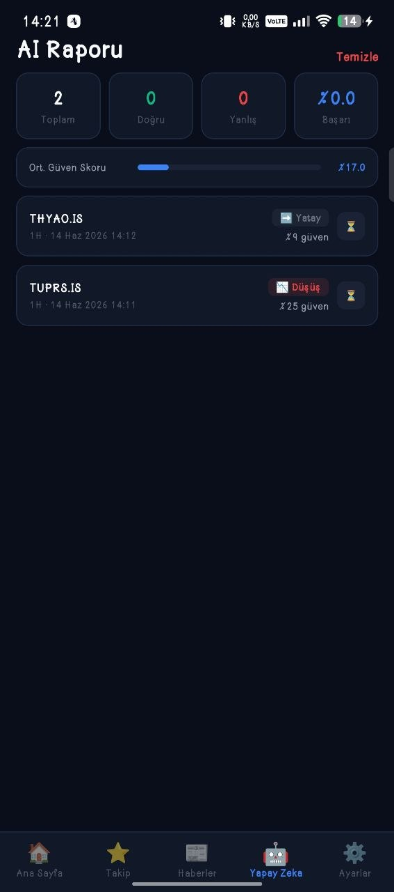
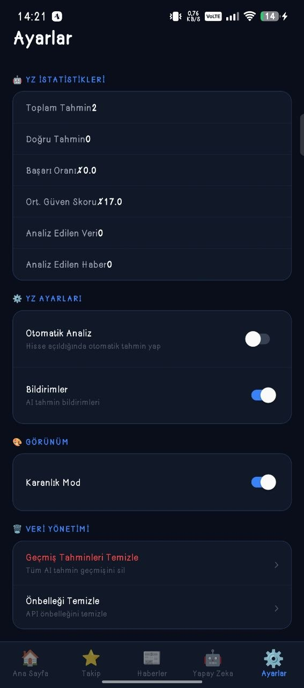
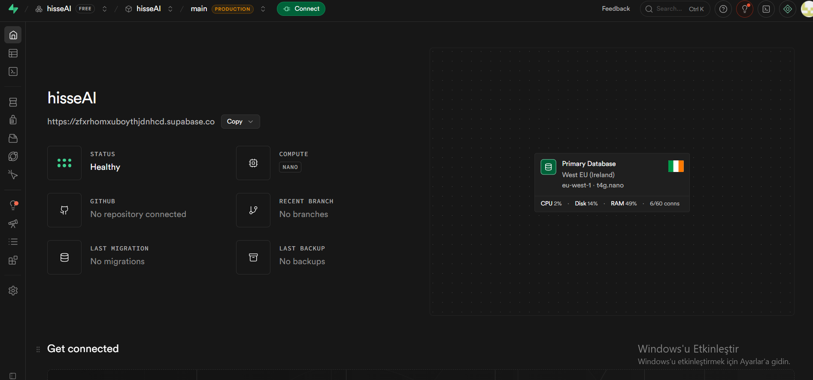
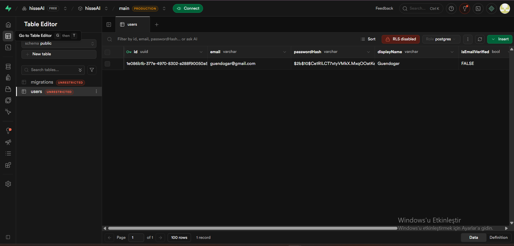
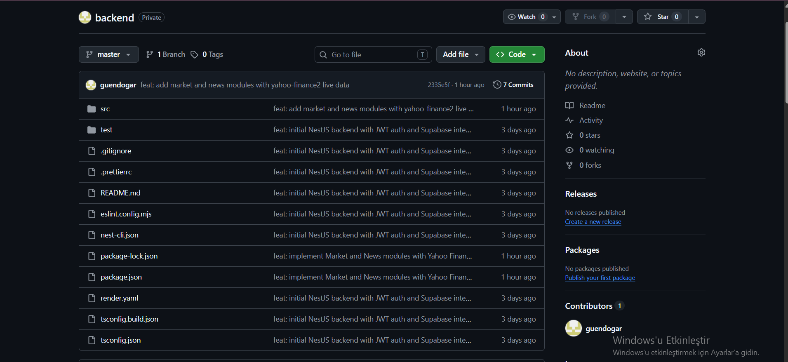
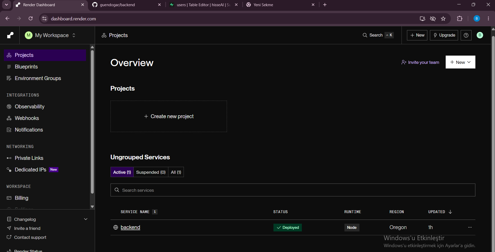
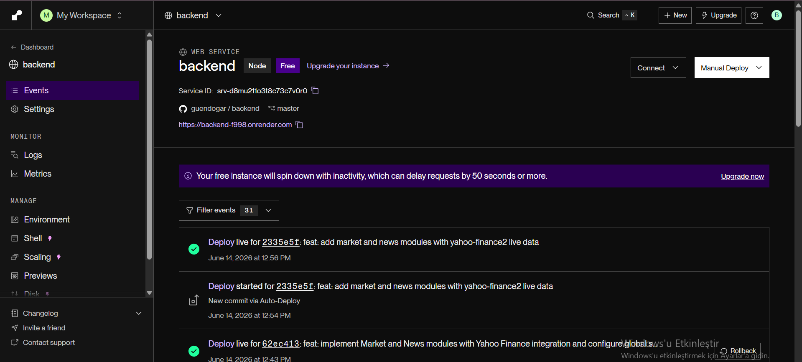

# HisseAI (AI-Powered Stock Market Analysis)

HisseAI, borsa takip işlemlerini yapay zeka destekli tahminlerle birleştiren, kullanıcı dostu ve modern bir mobil uygulamadır. Gerçek zamanlı haber takibi, hisse senedi tahminleri ve güvenli kullanıcı yönetimi özellikleri ile yatırımcılara rehberlik etmeyi hedefler.

## 🚀 Özellikler

- **Güvenli Kimlik Doğrulama**: Kullanıcı kayıt ve giriş işlemleri (Supabase üzerinden sağlanır).
- **Gerçek Zamanlı Haberler**: Finans dünyasından en güncel haberler ve gelişmeler.
- **Yapay Zeka Destekli Tahminler**: Seçili hisse senetleri için geleceğe yönelik yapay zeka analizleri ve fiyat tahminleri.
- **Portföy ve Ana Ekran**: Kullanıcının hisselerini kolayca takip edebileceği modern ana ekran tasarımı.
- **Özelleştirilebilir Ayarlar**: Kullanıcı profili ve uygulama içi ayar seçenekleri.

## 🛠 Kullanılan Teknolojiler

- **Frontend**: React Native (Cross-platform mobil uygulama)
- **Backend & Veritabanı**: Supabase (PostgreSQL, Authentication)
- **Dağıtım ve Sunucu**: Render
- **Sürüm Kontrolü**: Git & GitHub

## 🔒 Proje Güvenliği ve Backend Mimarisi Hakkında Bilgilendirme

**Değerli Hocamızın Dikkatine,**

Bu GitHub reposu, HisseAI projemizin **istemci (client/mobil)** tarafını içermektedir. Projemizin **backend, veritabanı (Supabase) ve sunucu konfigürasyon dosyaları**, içerdikleri hassas kimlik bilgileri, API anahtarları ve veritabanı bağlantı şifreleri sebebiyle siber güvenlik standartları gereği *public* (herkese açık) olarak paylaşılmamıştır. 

Uygulamamızın veri tabanı mimarisi, kimlik doğrulama süreçleri ve sunucu dağıtım aşamaları ile ilgili detaylı ekran görüntüleri ve şemaları, arka plan işleyişini inceleyebilmeniz adına aşağıdaki "Altyapı ve Backend" bölümüne eklenmiştir.

Anlayışınız için teşekkür eder, saygılarımızı sunarız.

## 📱 Ekran Görüntüleri

### Kullanıcı Arayüzü (Mobil Uygulama)

| Giriş Ekranı | Kayıt Ol Ekranı | Ana Ekran |
|:---:|:---:|:---:|
|  |  |  |

| Haberler Ekranı | Yapay Zeka Tahmin | Ayarlar Ekranı |
|:---:|:---:|:---:|
|  |  |  |

### Altyapı ve Backend

**Supabase Veritabanı ve Yönetim**
| Supabase Genel Bakış | Supabase Tabloları |
|:---:|:---:|
|  |  |

**Dağıtım ve Sürüm Kontrolü (Render & Git)**
| Git Backend | Render Dağıtımı | Render Projesi |
|:---:|:---:|:---:|
|  |  |  |

## ⚙️ Kurulum ve Çalıştırma

Projeyi yerel ortamınızda çalıştırmak için aşağıdaki adımları izleyebilirsiniz.

### Gereksinimler
- Node.js (Güncel bir LTS sürümü)
- React Native CLI veya Expo CLI (Proje yapısına göre)
- Android Studio / Xcode (Simülatör için)

### Adımlar

1. **Projeyi Klonlayın**
   ```bash
   git clone <github-repo-url>
   cd HisseAI
   ```

2. **Bağımlılıkları Yükleyin**
   ```bash
   npm install
   # veya
   yarn install
   ```

3. **Çevresel Değişkenleri Ayarlayın**
   Kök dizinde bir `.env` dosyası oluşturun ve gerekli Supabase / API anahtarlarını ekleyin:
   ```env
   SUPABASE_URL=your_supabase_url
   SUPABASE_ANON_KEY=your_supabase_anon_key
   ```

4. **Uygulamayı Başlatın**

   *Android için:*
   ```bash
   npm run android
   # veya
   yarn android
   ```

   *iOS için:*
   ```bash
   cd ios && pod install && cd ..
   npm run ios
   # veya
   yarn ios
   ```

---
*Not: Bu README dosyası proje yapısına göre düzenlenebilir. Eksik olan kurulum linklerini ve detaylı API dokümantasyonunu projenin gelişim sürecinde bu alana ekleyebilirsiniz.*
